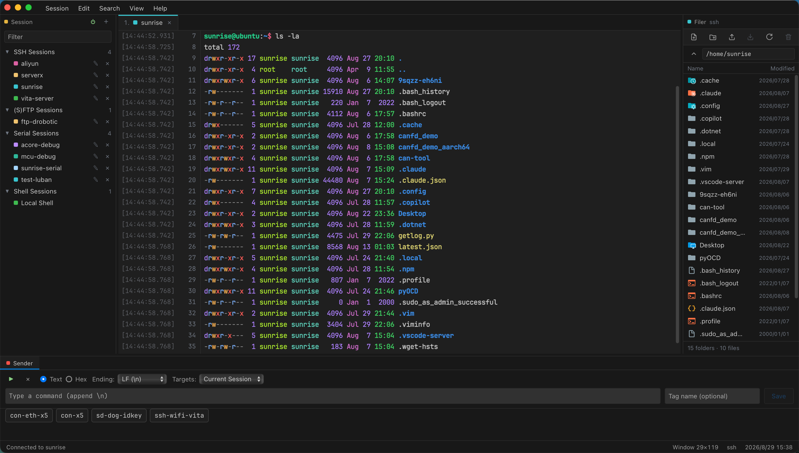
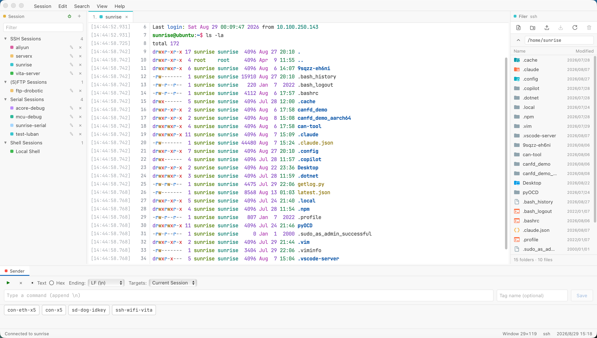

  <picture>
    <source media="(prefers-color-scheme: dark)" srcset="docs/logo-dark.png">
    
  </picture>

[English](README.md) | [简体中文](README.zh-CN.md)

A small, lightweight, high-performance terminal, SSH, SFTP, FTP, and serial client, built with **Rust + Tauri**.

## Small and lightweight

| Package (v0.4.1) | Download size |
| --- | --- |
| Windows x64 installer (`.exe`) | **3.9 MB** |
| macOS Apple Silicon (`.dmg`) | **4.7 MB** |
| Linux `.deb` (x64 / ARM64) | **5.3 MB** / **5.2 MB** |

## Features

**Session types**

| Type | Backend | Description |
| --- | --- | --- |
| Local shell | `portable-pty` | A real pseudoterminal with synchronized window resizing; the Shell field takes a command line with arguments, such as `wsl.exe -d Ubuntu` or `pwsh -NoLogo` |
| SSH | `russh` + `russh-sftp` | Password, public-key, and ssh-agent authentication; SFTP reuses the same connection with streaming file and folder transfers |
| SFTP | `russh` + `russh-sftp` | A file-transfer-only session over SSH — same authentication and host-key policy, opened straight into the dual-pane file manager with no terminal |
| FTP | `suppaftp` | Password or anonymous authentication; passive-mode browsing, UTF-8/GBK filename decoding, and streaming file and folder transfers in both directions |
| Serial | `serialport` | Configurable baud rate, data bits, stop bits, parity, and flow control |

**Interface**
- **Timestamp and line-number gutter** — WindTerm's most recognizable feature. Every output line includes `[HH:MM:SS.SSS]` and a cumulative line number, with the cursor line highlighted. Four display modes are available from the `Session` menu.
- **Session** (left): saved connection profiles in a collapsible tree; double-click to connect. Right-click a heading or a group to create (nested) groups, rename or delete them; right-click a session to connect, edit, move it to another group, or delete it. The New Session dialog lets you choose which group a session is saved to.
- **Filer** (right): a file browser that automatically switches to SFTP for SSH sessions, with file and folder upload (including drag & drop), file and folder download, create-directory, and delete operations. Other terminal sessions browse the local filesystem.
- **Sender** (bottom): send text or hexadecimal input with a chosen line ending (none / LF / CRLF) to the current session or to all open sessions at once. Saved commands are scoped — to one session, a Session panel group, a session kind (serial / SSH / shell) or everywhere — and the Sender lists the ones that apply to the active tab, most specific first.

**Command suggestions**

With **Edit → Command Suggestions** enabled, EdgeTerm remembers the commands you run in the terminal and shows matching history in a popup as you type. `↓` steps into the list, `Enter` / `Tab` accepts, `Esc` dismisses; while nothing in the popup is selected, every other key still reaches the shell. **Edit → Clear Command History…** clears the recorded history.

**Data export and import**

**Session → Export Data…** writes the saved sessions and their groups, the Sender's saved commands, and the display settings to a single `.edgeterm` file (plain JSON inside); **Session → Import Data…** accepts only `.edgeterm` files.

**ZMODEM transfers**

Local shell, SSH, and serial terminals automatically detect ZMODEM sessions. Run `rz` in the terminal to choose and send one or more local files, or run `sz <file>` to choose where each incoming file is saved.

**Keyboard shortcuts**

| macOS | Windows / Linux | Action |
| --- | --- | --- |
| `⌘N` | `Alt+N` | Open the new-session dialog |
| `⌘W` | `Ctrl+Shift+W` | Close the current session (asks for confirmation while it is still connected) |
| `⌘F` / `⌘G` | `Ctrl+Shift+F` / `Ctrl+Shift+G` | Search the terminal buffer / find next |
| `⌘K` | `Alt+K` | Clear the screen |
| `⌘[` / `⌘]` | `Alt+[` / `Alt+]` | Switch to the previous / next open session |
| `⌘1`–`⌘9` | `Alt+1`–`Alt+9` | Switch to tab N |
| `⌘⌥←` / `⌘⌥→` / `⌘⌥↓` | `Ctrl+Alt+←` / `Ctrl+Alt+→` / `Ctrl+Alt+↓` | Show or hide Session / Filer / Sender |
| `⌘C` / `⌘V` | `Ctrl+Shift+C` / `Ctrl+Shift+V` | Copy / paste inside the terminal |
| `⌘A` | `Ctrl+Shift+A` | Select the whole terminal buffer |

## Releases

| Platform | Package |
| --- | --- |
| Windows x64 | NSIS installer (`.exe`) |
| macOS Apple Silicon | `.dmg`, plus the `.app.tar.gz` bundle used by the in-app updater |
| Linux x64 / ARM64 | `.AppImage` and `.deb` |

Installed copies check the latest Release on startup and can update in place; **Help → Check for Updates…** does the same on demand.

Releases are not notarized on macOS or code-signed with Windows Authenticode; the macOS application uses ad hoc signing only, so the operating system may show a security warning on first install.
