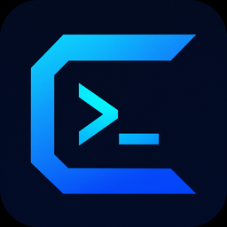

<p align="center">
  
</p>

<h1 align="center">EdgeTerm</h1>

[English](README.md) | [简体中文](README.zh-CN.md)

A small, lightweight terminal, SSH, SFTP, FTP, and serial client, built with **Rust + Tauri v2** and a React + xterm.js frontend. The installer is under 5 MB on Windows and macOS.

The entire SSH stack is written in pure Rust using `russh`. It does not depend on libssh2, OpenSSL, or pkg-config, so it can be compiled directly on any machine with a Rust toolchain installed.

## Small and lightweight

| Package (v0.4.1) | Download size |
| --- | --- |
| Windows x64 installer (`.exe`) | **3.9 MB** |
| macOS Apple Silicon (`.dmg`) | **4.7 MB** |
| Linux `.deb` (x64 / ARM64) | **5.3 MB** / **5.2 MB** |

Installed, the whole application is a single executable of about 5 MB; the frontend is compiled into it, so there is no separate resources folder to unpack. That is possible because EdgeTerm:

- renders in the WebView the operating system already ships (WebView2 on Windows, WKWebView on macOS, WebKitGTK on Linux) instead of bundling a Chromium and Node.js runtime the way Electron-based clients do;
- runs the backend as one native Rust binary, built with LTO, `opt-level = "s"`, `panic = "abort"`, and stripped symbols;
- implements SSH, SFTP, FTP, serial, and ZMODEM in Rust crates, so no OpenSSL, libssh2, or other native library has to be shipped alongside.

Updates are just as small: the in-app updater downloads the same few-megabyte package.

The only runtime dependency is that system WebView: Windows 11 and up-to-date Windows 10 already include WebView2 (the installer fetches it if it is missing), macOS has WKWebView built in, and the `.deb` depends on the distribution's `libwebkit2gtk-4.1` package.

## Features

**Session types**

| Type | Backend | Description |
| --- | --- | --- |
| Local shell | `portable-pty` | A real pseudoterminal with synchronized window resizing; the Shell field takes a command line with arguments, such as `wsl.exe -d Ubuntu` or `pwsh -NoLogo` |
| SSH | `russh` + `russh-sftp` | Password, public-key, and ssh-agent authentication; SFTP reuses the same connection with streaming file and folder transfers |
| SFTP | `russh` + `russh-sftp` | A file-transfer-only session over SSH — same authentication and host-key policy, opened straight into the dual-pane file manager with no terminal |
| FTP | `suppaftp` | Password or anonymous authentication; passive-mode browsing, UTF-8/GBK filename decoding, and streaming file and folder transfers in both directions |
| Serial | `serialport` | Configurable baud rate, data bits, stop bits, parity, and flow control |

SSH/SFTP/FTP passwords and SSH private-key passphrases are stored in `credentials.json` in the application configuration directory, readable only by the current system user. They are never returned to the frontend or written to `sessions.json`. As a result, saved sessions can reconnect after EdgeTerm restarts without triggering the macOS Keychain system-password authorization dialog.

`credentials.json` is not plain text: it is sealed with ChaCha20-Poly1305 under a key derived (HKDF-SHA256) from the machine id (`IOPlatformUUID` on macOS, `MachineGuid` on Windows, `/etc/machine-id` on Linux), the account name and a random salt kept in the file. There is nothing to set up or type: the file opens automatically on the machine and account that wrote it, and a copy is useless anywhere else. Be clear about what this does and does not cover: it protects the file at rest and in backups, but any program running under your account on the same machine can derive the same key, so a compromised account means a compromised password store. A file that cannot be opened (moved to another machine, or the machine id changed after an OS reinstall) is ignored and replaced on the next save; the sessions themselves are unaffected and simply ask for their passwords again. Files written by earlier versions are sealed on first start.

Standard FTP does not encrypt credentials or file contents. Use FTP only on a trusted network; use SSH/SFTP when transport security is required.

**Interface** (based on the WindTerm layout)

- **Timestamp and line-number gutter** — WindTerm's most recognizable feature. Every output line includes `[HH:MM:SS.SSS]` and a cumulative line number, with the cursor line highlighted. Four display modes are available from the `Session` menu.
- **Rich color rendering** — Supports ANSI 16-color, 256-color, and 24-bit true color, plus warm semantic highlighting for unstyled output that goes beyond WindTerm: prompts, options, operators and rainbow brackets, `ls -l` permission bits and owner columns, table headers, log levels and Kubernetes/Docker/systemd states, network addresses and domains, paths, Git diffs, HTTP, JSON/YAML, and more — with subtle line bands for errors/warnings, diffs and headers, and underlined links.
- **Session** (left): saved connection profiles in a collapsible tree; double-click to connect. Right-click a heading or a group to create (nested) groups, rename or delete them; right-click a session to connect, edit, move it to another group, or delete it. The New Session dialog lets you choose which group a session is saved to.
- **Filer** (right): a file browser that automatically switches to SFTP for SSH sessions, with file and folder upload (including drag & drop), file and folder download, create-directory, and delete operations. Other terminal sessions browse the local filesystem.
- **FTP / SFTP workspace**: FTP and SFTP sessions open a dedicated dual-pane file manager, with the remote server on the left and the local computer on the right. It supports two-way streaming transfers of files and whole folders plus create, rename, and non-recursive delete operations.
- **Sender** (bottom): batch sending with text or hexadecimal input, line-by-line or character-by-character modes, repeat counts, configurable intervals, and targeting of the current session or all sessions. Saved commands are scoped — to one session, a Session panel group, a session kind (serial / SSH / shell) or everywhere — and the Sender lists the ones that apply to the active tab, most specific first.
- Tabs, an address bar (`ssh › host:port`), and a status bar showing the terminal dimensions, cursor Ln/Ch, and protocol. The Session panel header carries a power toggle for the active tab (also **Session → Disconnect / Reconnect Session**): click it to disconnect the session while keeping the tab and its scrollback, and click again to reconnect in place.

**Data export and import**

**Session → Export Data…** writes the saved sessions and their groups, the Sender's saved commands, and the display settings to a single `.edgeterm` file (plain JSON inside); **Session → Import Data…** accepts only `.edgeterm` files, checks the file header, and merges the data back on another machine or after a reinstall (entries with the same id replace the local ones, nothing else is removed). Passwords and key passphrases are never exported — imported sessions ask for them again.

**ZMODEM transfers**

Local shell, SSH, and serial terminals automatically detect ZMODEM sessions. Run `rz` in the terminal to choose and send one or more local files, or run `sz <file>` to choose where each incoming file is saved. The peer must provide a compatible `rz`/`sz` implementation such as `lrzsz`. File I/O and terminal output remain binary-safe and files are read or written through fixed 1 MiB application chunks. Use **Session → Cancel ZMODEM Transfer** to stop an active transfer.

**Keyboard shortcuts**

| macOS | Windows / Linux | Action |
| --- | --- | --- |
| `⌘N` | `Alt+N` | Open the new-session dialog |
| `⌘W` | `Ctrl+Shift+W` | Close the current session (asks for confirmation while it is still connected) |
| `⌘F` / `⌘G` | `Ctrl+Shift+F` / `Ctrl+Shift+G` | Search the terminal buffer / find next |
| `⌘K` | `Alt+K` | Clear the screen |
| `⌘[` / `⌘]` | `Alt+[` / `Alt+]` | Switch to the previous / next open session |
| `⌘1`–`⌘9` | `Alt+1`–`Alt+9` | Switch to tab N |
| `⌘⌥←` / `⌘⌥→` / `⌘⌥↓` | `Ctrl+Alt+←` / `Ctrl+Alt+→` / `Ctrl+Alt+↓` | Show or hide Session / Filer / Sender |
| `⌘C` / `⌘V` | `Ctrl+Shift+C` / `Ctrl+Shift+V` | Copy / paste inside the terminal |
| `⌘A` | `Ctrl+Shift+A` | Select the whole terminal buffer |

Context-specific keys:

- **Search box** — `Enter` / `Shift+Enter` jump to the next / previous match, `Esc` closes the search; the find / find-next shortcuts above also work while typing in the box.
- **Command-suggestion popup** — `↓` steps into the list, `↑` / `↓` move through it, `Enter` or `Tab` accepts, `Esc` dismisses it. While the popup is only showing (nothing selected), every other key still reaches the shell.
- **Links in terminal output** — `⌘`-click on macOS, `Ctrl`-click on Windows / Linux.

Mouse copy / paste follows the usual terminal conventions and is set under **Edit**:

- **Edit → Right Click** — *Copy or Paste* (the Windows console convention and the default on Windows: right-click copies the selection if there is one, otherwise pastes), *Show Menu* (the default on macOS / Linux: a menu with Copy, Paste, Select All and Clear Buffer; the word under the pointer is selected first) or *Paste* (PuTTY / MobaXterm style).
- **Middle-click** always pastes the clipboard.
- **Edit → Copy on Select** — copies every selection to the clipboard as it is made (PuTTY / iTerm2 style; off by default).
- Programs that take over the mouse (vim, tmux with mouse support, htop) receive the clicks instead; on Windows / Linux hold `Shift` to bypass them.

On Windows / Linux, plain `Ctrl+letter` is always passed through to the shell (`Ctrl+C` interrupts, `Ctrl+W` kills a word, `Ctrl+K` kills to end of line), and `Alt+letter` is left to readline's Meta layer except for `Alt+N` and `Alt+K`, which readline does not bind. That is why the editing and search shortcuts use `Ctrl+Shift` there. On macOS, `Ctrl` and `Option` are never taken from the shell; only `⌘` combinations are app shortcuts.

## Running locally

```bash
npm install
npm run tauri dev      # Development mode
npm run tauri build -- --no-bundle  # Compile-only verification; do not create installers
npm run tauri build    # Build installers for the current platform
```

Requirements: Rust 1.80.1+ and Node 20.19+ (Node 22 LTS recommended). macOS also requires the Xcode Command Line Tools.

## Releases

Releases are built and published by the [Release workflow](.github/workflows/release.yml) on GitHub Actions. Each Release contains:

| Platform | Package |
| --- | --- |
| Windows x64 | NSIS installer (`.exe`) |
| macOS Apple Silicon | `.dmg`, plus the `.app.tar.gz` bundle used by the in-app updater |
| Linux x64 / ARM64 | `.AppImage` and `.deb` |

Installed copies check the latest Release on startup and can update in place; **Help → Check for Updates…** does the same on demand.

Releases are not notarized on macOS or code-signed with Windows Authenticode; the macOS application uses ad hoc signing only, so the operating system may show a security warning on first install.

## Known limitations

- ZMODEM transfer resume is not supported; restart an interrupted transfer from the beginning.
- Not yet implemented: port forwarding/tunneling, session recording and playback, and split panes with multiple tabs.
