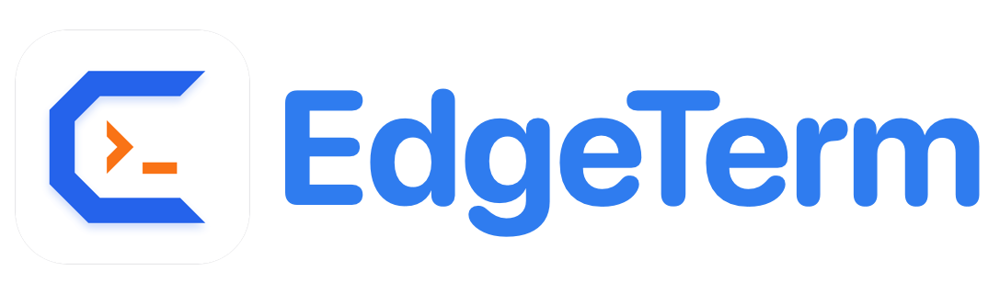
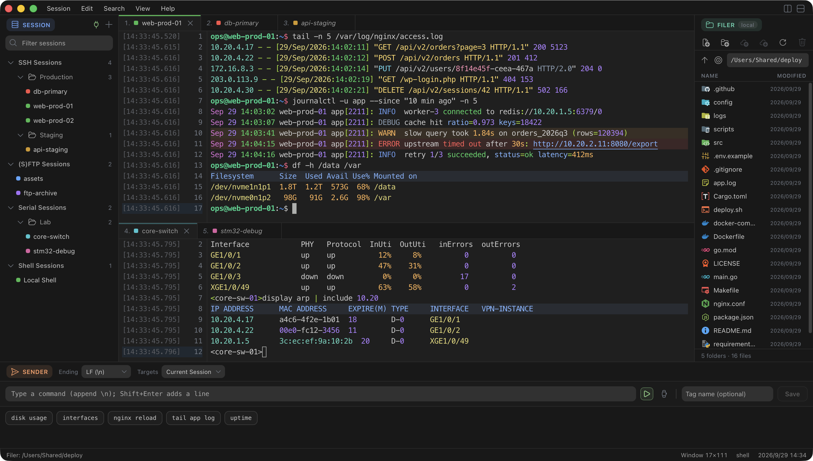
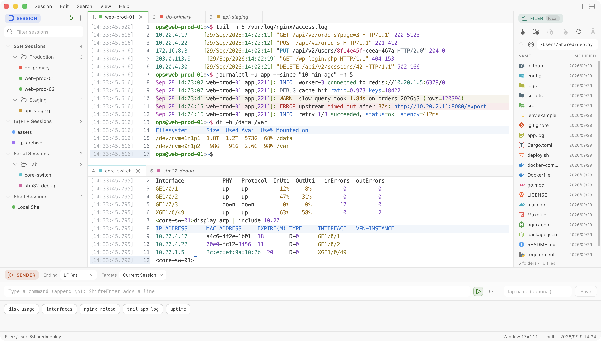

  <picture>
    <source media="(prefers-color-scheme: dark)" srcset="docs/logo-dark.png">
    
  </picture>

  
  

[English](README.md) | [简体中文](README.zh-CN.md)

小巧、快速的终端 / SSH / Telnet / SFTP / FTP / 串口客户端，基于 **Rust + Tauri**，安装包约 4–5 MB。

> [!TIP]
>  做嵌入式开发、需要用串口调试设备？推荐使用同一作者的 **[serialX](https://github.com/miskin-lee/serialX)**，一款专为串口调试打造的工作台。

## 功能

- **会话**：本地 Shell、SSH、Telnet、SFTP、FTP、串口，分组树管理，可筛选、复制，也可从 `~/.ssh/config` 导入。
- **SSH**：密码、公钥、ssh-agent、keyboard-interactive（MFA / 验证码）、跳板机，也能连只支持旧算法的网络设备。
- **易读的输出**：时间戳与行号栏，IP、URL、日志级别、HTTP 方法、路径、容量等语义着色。
- **分栏与标签**：向右 / 向下分栏，标签可在分栏间拖动，后台标签的运行 / 完成状态一眼可见。
- **Filer**：通过 SFTP、FTP 或本地磁盘浏览文件，支持与桌面之间双向拖拽。
- **Sender**：保存常用命令和多行脚本，发送到当前会话或全部会话，可定时重复。
- **终端内文件传输**：ZMODEM（`rz` / `sz`）与 XMODEM。
- **日常细节**：主题、字体、光标样式，自定义编码与 locale，会话录制，选中即复制，多行粘贴提醒，快捷键可改，全部设置可导出 / 导入。

## 安装

从 [Releases](https://github.com/miskin-lee/EdgeTerm/releases) 下载：

| 平台 | 安装包 |
| --- | --- |
| Windows x64 | 安装程序（`.exe`）或便携版 `.zip` |
| macOS Apple Silicon | `.dmg` |
| Linux x64 / ARM64 | `.AppImage`、`.deb` 或 `.rpm` |

- 未做 macOS 公证和 Windows Authenticode 签名，首次打开时系统可能会提示风险。
- 便携版的数据都存在 `EdgeTerm.exe` 旁的 `data` 文件夹里；换机器后保存的密码不会带过去。
- `.rpm` 需要 WebKitGTK 4.1（Fedora 有），较老的发行版请用 AppImage。
- 安装版会自动更新（**Help → Check for Updates…**），便携版只提示有新版本。

## 快速上手

1. **Session → New Session…**（`⌘N` / `Alt+N`）新建会话，在 Session 面板里双击连接；右键会话可编辑、复制、移动或删除。
2. 右侧 **Filer** 跟随当前标签：把文件拖进去即上传，拖出来即下载；`⌘J` / `Ctrl+Shift+J` 跳到 shell 的当前目录。
3. 底部 **Sender** 把文本发到当前会话或全部会话，常用命令可存成标签。
4. 标签右键菜单和 **View** 里有 **Split Right / Split Down**，把标签拖到别的分栏即可移过去。
5. **Edit** 里是复制粘贴相关设置（右键行为、选中即复制、OSC 52），**View** 里是主题、字体和 **Keyboard Shortcuts…**。

## 快捷键

| macOS | Windows / Linux | 作用 |
| --- | --- | --- |
| `⌘N` | `Alt+N` | 新建会话 |
| `⌘W` | `Ctrl+Shift+W` | 关闭会话 |
| `⌘F` / `⌘G` | `Ctrl+Shift+F` / `Ctrl+Shift+G` | 查找 / 查找下一个 |
| `⌘K` | `Alt+K` | 清屏 |
| `⌘J` | `Ctrl+Shift+J` | 在 Filer 中显示当前目录 |
| `⌘[` / `⌘]` | `Alt+[` / `Alt+]` | 上一个 / 下一个标签 |
| `⌘1`–`⌘9` | `Alt+1`–`Alt+9` | 切到第 N 个标签 |
| `⌘\` / `⌘⇧\` | `Ctrl+Shift+\` / `Ctrl+Alt+\` | 向右 / 向下分栏 |
| `⌘⌥[` / `⌘⌥]` | `Ctrl+Alt+[` / `Ctrl+Alt+]` | 上一个 / 下一个分栏 |
| `⌘⌥←` / `⌘⌥→` / `⌘⌥↓` | `Ctrl+Alt+←` / `→` / `↓` | 显示 / 隐藏 Session、Filer、Sender |
| `⌘C` / `⌘V` / `⌘A` | `Ctrl+Shift+C` / `V` / `A` | 复制 / 粘贴 / 全选 |

除标签序号键外，都可在 **View → Keyboard Shortcuts…** 中修改。

## 许可证

EdgeTerm 采用 [GNU General Public License v3.0](LICENSE) 授权。

界面图标来自 Microsoft 的 [Codicons](https://github.com/microsoft/vscode-codicons)，依据 Creative Commons Attribution 4.0 许可使用。

应用名称“EdgeTerm”及其图标不在上述开源许可范围内，版权 © 2026 miskin，保留所有权利。
